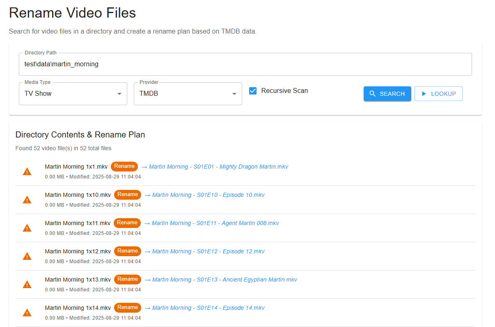
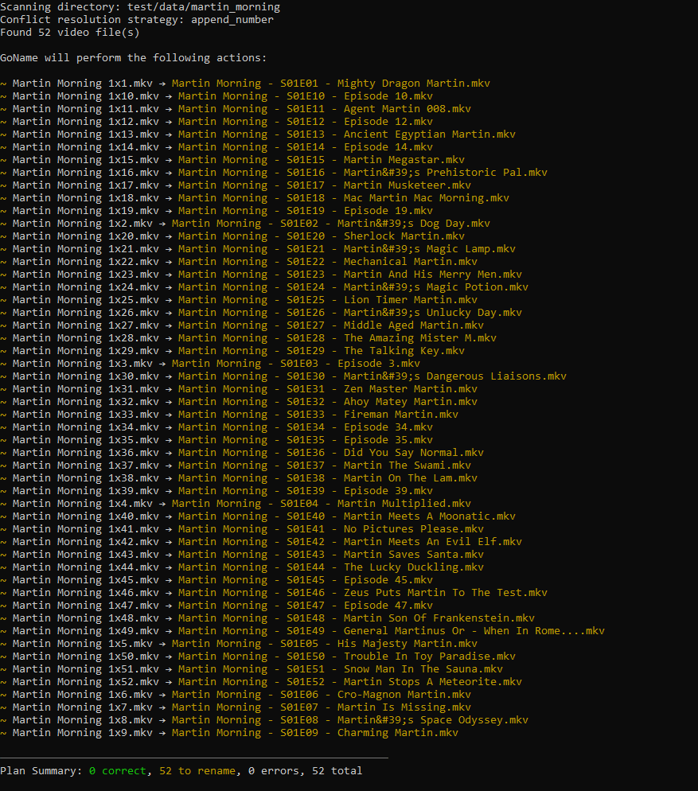

# Goru

**Goru** *(Golang Rename Utility)* is a powerful yet simple tool for renaming your video files.  
It helps you keep your media library clean, organized, and easily searchable—whether you prefer the CLI or a Web App.


## Features

- **🚀 Dual interfaces**: Use either the CLI or the Web app
- **📂 Batch rename**: Quickly rename a large number of video files
- **🎬 Metadata integration**: Fetch details from popular databases:
  - [TheMovieDB](https://www.themoviedb.org/)
  - [TheTVDB](https://www.thetvdb.com/)
  - [AniDB](https://anidb.net/)
- **💬 Subtitle support**: Download subtitles from OpenSubtitles
- **🔄 Safe operations**: Revert changes at any time

## Web app

The Web app aims at providing a tool that you will deploy within your architecture and will take care of your collection.

### Screensots



## CLI

For automation purposes.

### Screenshots



### Usage

#### On a single directory (aka no config file)

Perfect for quick checks or CI/CD pipelines.

```bash
# Preview planned changes in the current directory
goru plan --dir .

# Apply changes automatically
goru apply --dir . --auto-approve

# Roll back changes if needed
goru state revert --all
```

#### Handle multiple directories (aka providing a config file)

